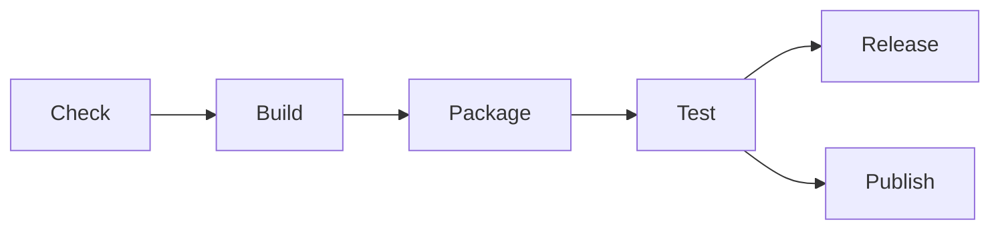

# Welcome

Welcome to the onboarding section of the documentation.
This section will guide you through the fundamentals of the Catalyst CI process and introduce you to the various tools and processes
that we use.

## Overview

<!-- markdownlint-disable max-one-sentence-per-line -->
!!! Note
    This section will talk about concepts related to [Earthly](https://earthly.dev).
    If you are not familiar with Earthly, please head over [to the appendix](../appendix/earthly.md) to learn more about it before
    continuing.
<!-- markdownlint-enable max-one-sentence-per-line -->

The CI process works through a discovery mechanism that identifies `Earthfile`s in a repository and filters them by target.
During every run, the CI will automatically discover and execute a select number of reserved targets.
Each of these targets serves a single purpose and together they are responsible for executing the entire release process.

The CI process is designed to be modular and reusable across a variety of different requirements.
By default, if a specific target the CI executes is not found in the discovery phase, it simply passes and moves on to the next one.
This allows slowly building out a repository and only implementing the targets that make sense at that time.

The discovery and execution nature of the CI allows developers to contractually define the outputs of the particular subproject they
happen to be working within.
For example, a developer can introduce a new `Earthfile` into the `service-a` subdirectory of a mono-repo and begin using the
reserved target names to interact with the CI.
This promotes self-service and establishes a clear boundary of ownership whereby developers only need to be concerned about
maintaining a single file in their subproject.

The CI process is well-documented and troubleshooting unexpected errors only requires knowledge of Earthly and GitHub Actions.
All of the code is contained in a single open-source repository and contributions are welcome.
The remainder of the overview section will focus on discussing some of these concepts in more detail.

### Discovery

The discovery process serves as a critical piece in the overall CI strategy.
It enables a declarative approach whereby developers can declare the deliverables of their particular subproject and rely on the CI
process to reconcile them.
This reduces the friction of onboarding while simultaneously establishing a separation of concerns in a complex mono-repo
environment.

During a single run, the CI will go through multiple phases of discovery.
In each of these discovery phases, a custom CLI provided by the `catalyst-ci` repository is executed.
The CLI is responsible for recursively scanning the repository for `Earthfile`s and filtering them by target.
For example, during the `check` phase of the CI, the CLI will return a list of `Earthfile`s that contain the `check` target.

The discovery phase will then return a list of `Earthfile`s matching the given criteria.
This list is fed into a [matrix job](https://docs.github.com/en/actions/using-jobs/using-a-matrix-for-your-jobs) that multiplexes
executing the targets from each of the discovered `Earthfile`s.
By running targets in parallel, we maximize network throughput and create an easier to digest view of the CI status.
For example, by doing this, every individual target gets its own dedicated job and logs that can be easily seen from the GitHub
Actions UI.

### Execution

After each discovery phase, a list of targets will be executed by the CI in parallel.
Execution is handled by Earthly and usually occurs on a remote Earthly runner that maximizes the benefits of caching.
The exact steps that get executed by the target is defined by the developer.
While most targets generally have a clearly defined scope, the overall goal is to enable adaptability by offloading the logic to the
developer who is more aware of their immediate context.

Some targets have additional processing beyond simply executing the target and returning.
For example, the `publish` target is expected to produce a single container image that is then further processed by the CI system.
The image will go through static analysis and ultimately get published to multiple image registries depending on the context.
The exact targets that are available, as well as their scope and function, can be explored more in the reference documentation.

### Pipeline

The full CI process consists of combining the discovery and execution mechanisms into a complete pipeline, as shown above.
Each of the boxes represent a distinct stage which consists of discovering and then executing a target.
As previously mentioned, some stages, like the `release` and `publish` stages, have additional logic that occurs after executing the
target.

Each stage is self-contained and the only dependency occurs when validating that the previous stage was successful.
For example, the `build` stage will not execute until the `check` stage has passed.
Recall that stages consist of executing multiple targets in parallel.
This means that all subprojects within a repository must pass the `check` stage before any building will begin.
This fits into the overall goal of ensuring that the default branch is always in a healthy state and it also promotes cross-team
collaboration.

The exact scope of each stage is documented in the reference section.
However, as a short introduction, here is a brief summary of each one:

1. `check` - This stage is expected to run all necessary checks to validate the health of the project.
   This includes formatting, linting, and other static analysis tools.
   The goal of this stage is to provide a quick way to validate the overall health of the code and avoid wasting cycles on building
   unhealthy code.
1. `build` - This stage is expected to build any artifacts provided by a given subproject.
   The primary purpose of this target is to validate that things are building without error.
   It also ensures that builds are cached prior to executing subsequent steps that typically depend on these builds.
1. `package` - This stage is expected to package multiple artifacts into a single package.
   It is typically used outside of the scope of a single subproject and instead combines outputs from multiple subprojects into a
   single deliverable.
   As such, it typically doesn't appear within the scope of a single subproject and is instead found in `Earthfile`s at higher
   points in the repository hierarchy.
1. `test` - This stage is expected to run tests that prove the subproject, or multiple subprojects, are working as expected.
   The target can be used to run any sort of test, including unit tests, smoke tests, and integration tests.
1. `release` - This stage is expected to produce a single release artifact.
   This could be a binary, a collection of resources, or even certain reports.
   When a tag commit is pushed, the CI will build this target and include the produced artifact as part of a GitHub Release.
1. `publish` - This stage is expected to produce a single container image.
   After the image is built by executing the target, the CI will perform other steps to transform the image.
   For example, tagging it with the git commit hash and performing general static analysis.
   The CI will automatically build and publish this image to configured registries during certain types of git events.

Each of the above stages are purely optional and can be combined to perform different types of CI workflows.
For smaller projects, only a number of stages will be utilized initially.
However, as a project grows, it can begin incorporating more stages without having to fundamentally alter the CI system.

## Usage

Now that we've covered how the CI process works at a conceptual level, how can we use it practically?
As a developer, the main interface you need to be most concerned with is the `Earthfile`.
Each "stage" discussed in the previous section can be directly correlated to an Earthly target.
For example, the `check` stage will search for and execute a `check` target.
In your `Earthfile`, you'll be responsible for defining these targets and their associated logic within the context of your
subproject.

If you're contributing a new subproject with deliverables, you'll need to include an initial `Earthfile` as part of the
contribution.
Likewise, if you add a new deliverable to an existing project, you'll need to make sure it's captured in the existing `Earthfile`.
Not all `Earthfile`s are constrained to a single subproject.
In many cases, an `Earthfile` exists at higher points in the repository hierarchy that performs packaging and testing across
multiple subprojects.
This is especially true for integration testing, and it something you need to take into account when providing new features.

Not all targets need to be present in your `Earthfile`.
For a project that is still gaining maturity, it might make sense to only define the `check` and `build` targets until the project
is ready to be tested and shipped.

## Getting Started

Before creating and/or modifying an `Earthfile`, it's imperative to review the style guide.
Due to the relative flexibility of Earthly, it's possible to structure an `Earthfile` in dozens of valid ways.
To provide consistency across our projects, we have implemented a style guide which brings a level of standardization to
`Earthfile`s.

The next step after reviewing the style guide is taking a look at the examples provided in the `catalyst-ci` repository.
The examples are broken up by language and serve as a starter template for getting off the ground quickly.
Reviewing the examples also helps with connecting the concepts discussed in this onboarding guide with actual code.

Experimentation is also encouraged.
The CI process runs on every single commit, even commits to PRs.
You can utilize this fact to begin experimenting with an `Earthfile` and seeing how the CI reacts to different targets.
The only limitation is that not all targets execute fully in a PR setting (i.e. no artifacts are published/released).

Finally, if you get stuck, or have a need to understand the the CI process more, there is reference documentation available which
covers not only individual targets, but also how the entire CI process operates under the hood.
You may also use the discussions section of the `catalyst-ci` repository to ask questions specific to the CI process.

You are now equipped and ready to start using the Catalyst CI!
We are very open-source friendly and will review all feedback/PRs made against the repository.
So please be encouraged to contribute.
